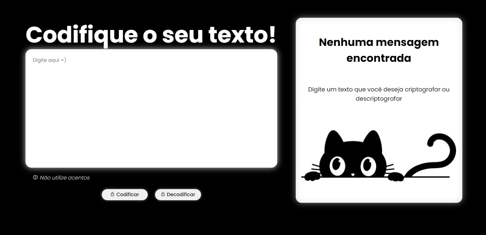
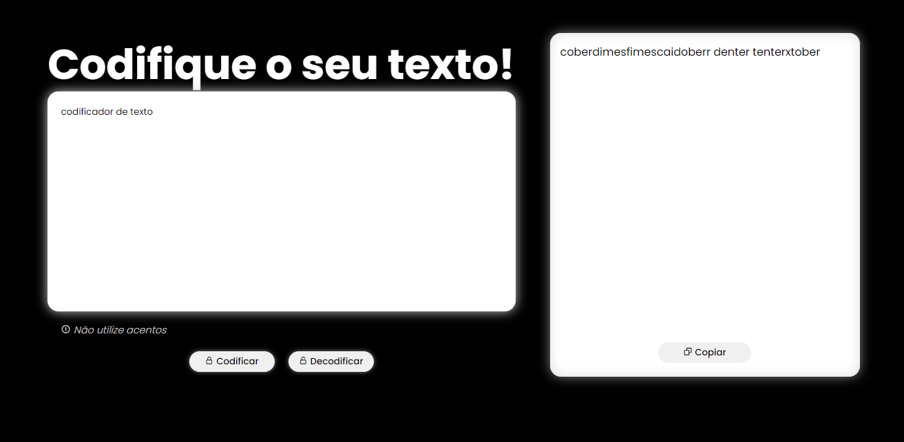
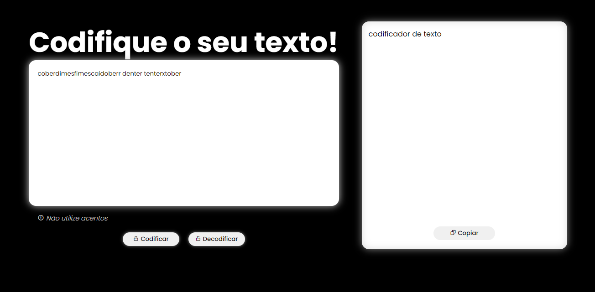

<h1  align="center"> :cat: Encriptador de Texto  </h1>

<h2> :mag_right: Descrição da Página </h2>

Esse é o meu primeiro challenge da Oracle Next Education, você pode ver clicando <a href="https://daysecampos.github.io/encriptadorDeTexto/">aqui</a>, acessando o link na descrição ou baixando! 

A ideia do projeto era fazer um encriptador de texto que modifica as vogais da seguinte forma:

<ul>
  <li>a = ai; </li>
  <li>e = enter;</li>
  <li>i = imes;</li>
  <li>o = ober;</li>
  <li>u = ufat.</li>
</ul>

 

<strong> :lock: Texto codificado</strong>

  

  
  

<strong> :unlock: Texto decodificado</strong>

  

<h2> :rocket: Tecnologias Utilizadas </h2>

<ul>
<li>HTML: Toda a estrutura da página foi feita com o HTML;</li>
<li>CSS: Toda a estilização foi feita com o CSS;</li>
<li>Javascript: A criptografia foi montada utilizando o DOM, orientação a objetos, manipulação de arrays e outros conceitos.</li>
</ul>
